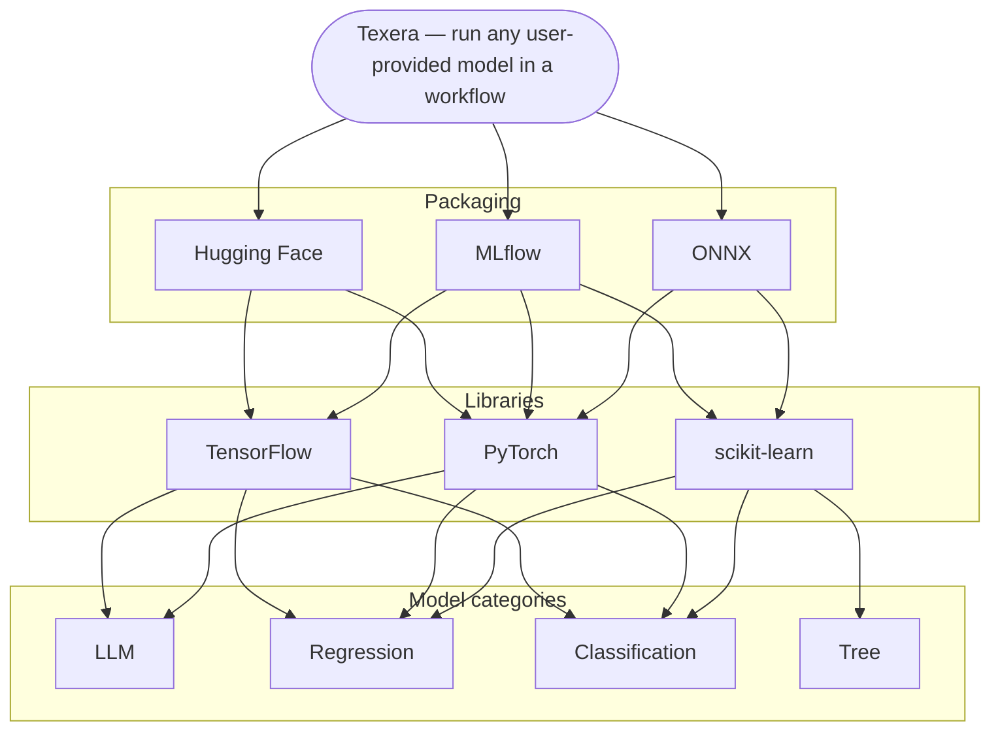

# Supporting user-provided ML models in workflows

## Goal
Make Texera a platform where a user can **bring their own trained model and run it inside a
workflow** — upload the model, pick it in an operator, and get predictions on the data stream.

## Context
- We already have a **Hugging Face operator** for hosted/third-party models — that's a separate,
  ongoing effort.
- This proposal is about **models the user uploads themselves** (their own trained weights),
  stored and versioned in Texera like datasets.

## Scope
- **Step 1: PyTorch** — first framework we support end-to-end.
- **Next:** TensorFlow, then scikit-learn — same flow, more loaders.

## Storage
Models are stored **exactly like datasets** — versioned in LakeFS with the bytes in MinIO — so we
reuse the existing upload, versioning, and access-control stack. A model is simply an asset tagged
with a type (`DATASET` or `MODEL`); To namespace by type, logical file paths now
carry a resource-type prefix — `/datasets/<owner>/<name>/<version>/<file>` and, for models,
`/models/<owner>/<name>/<version>/<file>` — resolved through the same path → LakeFS → MinIO chain.
A dedicated **Models** section in the UI mirrors Datasets for browsing and uploading.

## Two user experiences
Both reuse the existing dataset storage (LakeFS/MinIO); a model is just an uploaded asset the
operator/UDF fetches at run time.

1. **No-code operator** — drag a "Model Inference" operator, select the uploaded model, choose the
   input columns and the output column. No code. Best for non-technical users.
   

2. **Python UDF** — select the model in the UDF's property panel; the framework fetches + loads it
   and exposes it to your code, so you only write the inference logic. For users who need custom
   pre/post-processing.
   

## Design (from #4198)

## Where this fits (from our discussion)
There are three layers to keep in mind:

- **Packaging / interchange formats:** Hugging Face, MLflow, ONNX — ways to package a model for portability.
- **Training libraries:** TensorFlow, PyTorch, scikit-learn — what users actually train with.
- **Model categories:** LLMs, regression, classification, tree-based.

Our proposed approach is to support models **per library** (PyTorch first) rather than committing to a
single packaging standard up front. A packaging/interchange format (e.g. ONNX) could be layered on
later for cross-library portability — flagged as an open question below.

## Feedback wanted
We'd love feedback on the **overall idea and the proposed architecture**:

- Does positioning Texera as "bring your trained model, run it in a workflow via an operator" make sense?
- Is treating a model as an **asset** and reusing the dataset storage stack (LakeFS/MinIO) the right foundation?
- Is supporting models **per library** (PyTorch first), rather than committing to one packaging format, a reasonable starting point?
- Do the **two user experiences** (no-code operator + Python UDF) cover the right range of users?

All thoughts, concerns, and alternative approaches welcome.

