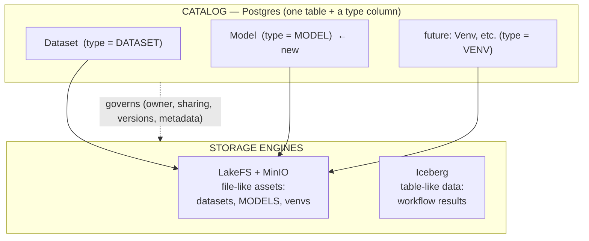
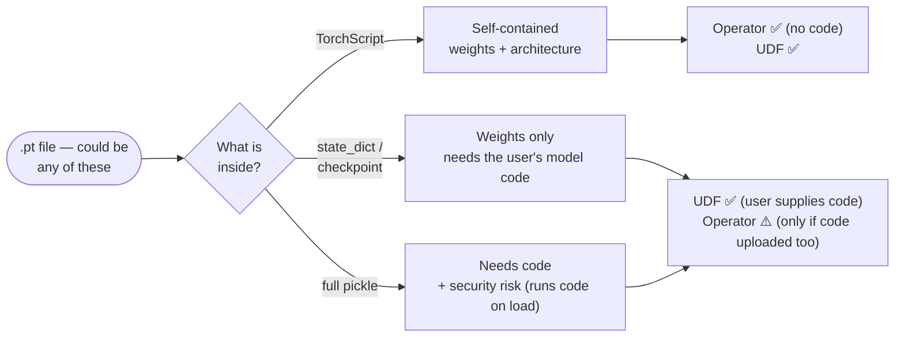
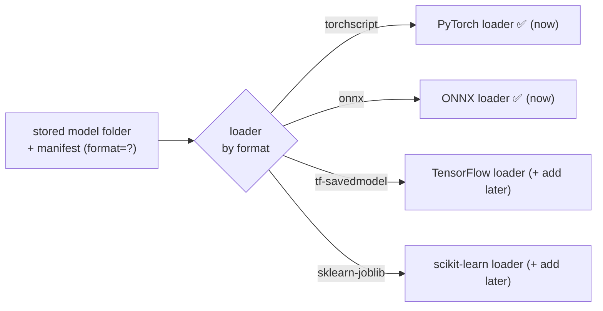

# Supporting ML Models in Texera — Findings Summary

_A brief for review. Backed by three research passes + a codebase audit; detailed docs linked at
the end. Goal: agree on the direction, then turn the agreed points into a GitHub discussion._

---

## TL;DR (one paragraph)

A **model is just another kind of asset** — we store it exactly like a dataset (a versioned folder
of files in LakeFS/MinIO), marked with a `type = MODEL` field and a small `properties` record. **No
new database tables.** At run time, a shared step fetches the model's files, reads a tiny
auto-generated **manifest** that says *how to load it*, and hands a ready-to-use model to either a
**no-code operator** or a **Python UDF**. This same pattern extends cleanly to TensorFlow and
scikit-learn later (just one small "loader" per framework) and to entirely new asset types (e.g. a
`venv`) without redesign. We keep our **catalog (Postgres) separate from storage (LakeFS/Iceberg)**
— the pattern every major system uses — so models are simply the first new **LakeFS asset**.

---

## 1. The big picture — one catalog, models are a LakeFS asset

Texera already has two storage engines. We are **not adding a third** — a model is a file-like
asset, so it rides the existing **LakeFS** stack (the same one datasets use).

**Why keep the catalog separate from storage?** Because "what an asset *is*" (its name, owner,
type, versions, who can see it) is a different job from "where the *bytes* live." Every major system
splits these two — Databricks **Unity Catalog**, **Lakehouse** architecture (Berkeley, 2021),
Google **GOODS**, Apache **Gravitino**. Keeping metadata in Postgres and bytes in LakeFS/Iceberg
means: models reuse all the dataset governance (sharing, versioning) for free, and adding a new
asset type is a **catalog change**, not a storage rebuild.

---

## 2. The `.pt` reality — one extension, several different things

The core technical fact the professor should know: **a `.pt` file is not one format.** The same
extension can hold very different things, and only some can run without the user's original code.

| What's in the `.pt` | Contains | Can we load it with no user code? | Where it works |
|---|---|---|---|
| **TorchScript** | weights **+** architecture | ✅ yes | **Operator + UDF** |
| **state_dict / checkpoint** | weights only | ❌ needs their model class | **UDF** (or Operator if code uploaded) |
| **full pickle** (`torch.save(model)`) | weights + a reference to the class | ❌ + unsafe (runs code on load) | **UDF only**, discouraged |

**How we handle it (and keep it easy for non-developers):**
- On upload we **auto-detect** which kind it is (by safely inspecting the file, without running it)
  and **generate the manifest** — the user writes nothing.
- If it's **TorchScript** → works everywhere, zero code. **This is what we steer people toward.**
- If it's a **bare weights file that needs their code** → the UI asks them to also upload their
  code folder, or to re-export as TorchScript (one-line command). This is an *inherent* PyTorch
  limitation, not something any platform can remove.

---

## 3. How it's used — Operator vs. UDF (shared plumbing)

Both the no-code operator and the low-code UDF sit on **one shared loading step**, so we build the
hard part once.

```mermaid
flowchart TB
  U(["User picks a model in the panel"]) --> P
  subgraph P["SHARED STEP (Python worker)"]
    P1["1&#46; download the model's folder<br/>(same presigned-URL path datasets use)"]
    P2["2&#46; read manifest → framework/format"]
    P3["3&#46; run the matching loader → 'texera_model'"]
    P1 --> P2 --> P3
  end
  P --> OP["MODEL INFERENCE OPERATOR (no code)<br/>user just picks input columns +<br/>names the output column"]
  P --> UDF["PYTHON UDF (low code)<br/>'texera_model' is preloaded;<br/>user writes ~3 lines of inference"]
```

- **Operator** = best for non-technical users: no code, pick columns visually.
- **UDF** = for users who want control, custom preprocessing, or who bring a model that needs their
  code.
- **Feasibility:** self-contained models (TorchScript/ONNX) work in **both**. Models that need code
  work in the **UDF** naturally, and in the **operator** only if the code folder is uploaded too.

---

## 4. Extending to TensorFlow & scikit-learn — easy by design

**Storage never changes** — a TF model is a folder, an sklearn model is a file; both are "a
versioned folder of files," same as PyTorch. Only **one small loader function** is added per
framework:

Adding TensorFlow or scikit-learn = write one loader + accept its file type. **No database change,
no storage change, and it automatically works in both the operator and the UDF.**

> Worth noting: our stated audience (bioinformatics researchers, students) leans toward
> **scikit-learn / classic ML**, so it may be worth supporting sklearn early — or using **ONNX** as
> a universal, safe target — alongside PyTorch. (A sequencing question for discussion.)

---

## 5. Adding a totally new asset later (e.g. a `venv`)

Because a model is "a folder of files + a `type` + a manifest," **any file-like asset works the same
way.** To add a `venv` (or prompt library, vector index, etc.):
1. add a new `type` value (`VENV`),
2. define its manifest shape,
3. add a worker handler for it.

Stored as a LakeFS folder, versioned like everything else — **no new table.**

> **Caveat on venv / computing units:** *storing* a venv fits this model fine, but *activating* one
> is a **runtime** concern (like computing units) — a separate flow, not a stored-asset concern. So
> the storage part fits here; "making it live" does not. (This is the boundary to keep clean.)

---

## 6. How other platforms let users bring & use their own models

Every comparable system converges on the **same pattern we're proposing** — a model is attached to
a workflow like a dataset, with two tiers: a no-code path over a standard format, plus a code
escape hatch.

| Platform | How you bring a model | How you use it | Takeaway for us |
|---|---|---|---|
| **Kaggle Models** | upload via GUI, or push from a notebook | **"Add Models" (just like Add Datasets)** → mounted into the same `/kaggle/input/` folder, then loaded in code | **Direct validation:** models are treated exactly like datasets — read-only inputs mounted into a folder. Our plan, in the most-used DS platform. |
| **KNIME** (visual workflow — closest to Texera) | PMML Reader node, or a Python node | a portable **PMML** model is the format passed between nodes; Python node for anything else | a **portable standard format** powers the no-code path (PMML for classic ML ≈ our ONNX/TorchScript). |
| **Dataiku** | import as a "Saved Model" via **MLflow** format | deploy for scoring / evaluate on a dataset — **must supply a Code Env with the model's packages** | "bring your own" = wrap it + **supply its environment** (validates our manifest + worker-deps point). |
| **Orange** (visual, education — like our student users) | **Load Model** widget (a pickle file) | feeds a Predictions widget; **input data must have compatible attributes** | file-based model passing + **schema/IO compatibility** matters (our IO signature). |
| **Hugging Face Hub** | push a repo (weights + config + tokenizer) | `from_pretrained(...)` or hosted Inference API | repo-per-model + metadata; safetensors default. |
| **OpenML** | share data / models / results | integrated into Weka, R, RapidMiner, KNIME | a sharing/reproducibility hub layered on top of tools. |

**What this confirms (all consistent with our design):**
- **A model is an asset attached like a dataset** — Kaggle literally mounts models into the *same
  input folder* as datasets. Exactly our plan.
- **The no-code path rides a portable/standard format** — KNIME→PMML, others→ONNX. Reinforces
  steering users to self-contained formats.
- **"Bring your own" always means "and declare its environment"** — Dataiku requires a Code Env; we
  capture this in the manifest + worker dependencies.
- **Two tiers everywhere** — a no-code/standard-format path + a code escape hatch — mirrors our
  **Operator + UDF** split.

_Sources: [Kaggle Models docs](https://www.kaggle.com/docs/models) ·
[KNIME PMML integration](https://www.knime.com/blog/pmml-integration-in-knime) ·
[Dataiku MLflow model import](https://doc.dataiku.com/dss/latest/mlops/mlflow-models/importing.html) ·
[Orange Load Model widget](https://orangedatamining.com/widget-catalog/model/loadmodel/)._

---

## 7. Points worth flagging (don't miss these)

- **Security:** arbitrary `.pt` "full pickle" files run code when loaded — a real concern on a
  multi-user platform. Mitigation: prefer self-contained/safe formats (TorchScript, **ONNX**) for
  the no-code path; treat raw pickles as trusted-only, UDF-only.
- **Preprocessing is part of the model:** many real models need their tokenizer/scaler/encoder, not
  just weights. scikit-learn `Pipeline` (preprocessing + model in one file) is actually the
  *friendliest* real-world unit.
- **Versioning & aliases:** reuse the dataset versioning; consider a mutable alias (e.g.
  "Champion"/"Latest") so a workflow can point to "the current model" — borrowed from MLflow/Unity
  Catalog.
- **Sharing/access control:** models inherit dataset sharing (public/private). One known gotcha:
  locally-run compute units need the model public today (a JWT/credentials fix, already understood).
- **Our LakeFS is open-source:** advanced features (Mount, fine-grained access control) are paid
  Enterprise — so our current presigned-URL fetch is the correct approach, not a gap.

---

## 8. Recommendation & next step

**Build now (minimal, matches the plan):** models as `type = MODEL` on the existing table + a
`properties` field, stored on LakeFS, PyTorch (TorchScript) first, consumed via operator + UDF over
one shared loader. **Design the seam** so TF/sklearn and future asset types drop in without
redesign.

**Next step:** once we agree on the direction, I'll turn the agreed points into a **GitHub
discussion** for the community, with the key open decisions (format policy & security, sklearn/ONNX
sequencing, versioning/aliases, the generic-asset abstraction).

---

_Detailed backing docs: [Model formats & loading](ML_MODELS_RESEARCH_FINDINGS.md) ·
[Model types primer](ML_MODELS_PRIMER.md) · [Concrete storage design](ML_MODELS_STORAGE_DESIGN.md) ·
[LakeFS/Iceberg feature depth](ASSET_STORAGE_ENGINE_RESEARCH.md) ·
[Extensible-asset architecture + literature](EXTENSIBLE_ASSET_ARCHITECTURE_RESEARCH.md)._
