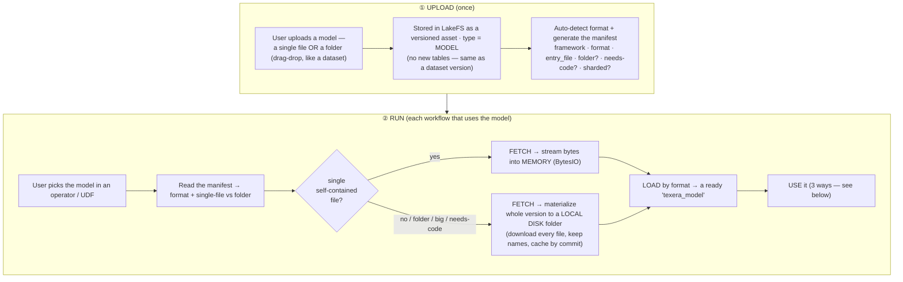
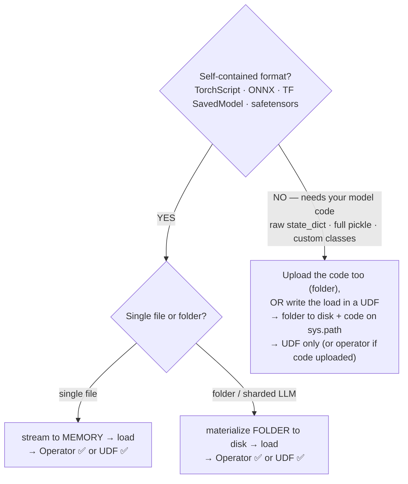

# Loading a Model in Texera — Complete Flow & All Options

_The end-to-end path from upload to use, and every option for how a model gets loaded. Consolidates
the earlier findings ([primer](ML_MODELS_PRIMER.md) · [storage](ML_MODELS_STORAGE_DESIGN.md) ·
[folder loading](ML_MODELS_FOLDER_LOADING.md))._

---

## The complete flow (upload → use)

The two halves: **upload** stores the model like a dataset + records a manifest; **run** fetches it
(memory or disk), loads it by format, and hands it to your operator/UDF.

---

## Option set 1 — how it's FETCHED (memory vs disk)

| The model is… | Fetch | Why |
|---|---|---|
| **A single self-contained file** (TorchScript, one safetensors, one small ONNX) | **into memory** (`BytesIO`) | small; loader accepts a byte handle — no temp file needed |
| **A folder** (TF SavedModel, ONNX + external data, HF/transformers, **sharded LLM**), or big, or needs code | **to a local disk folder** (materialize the whole version, cached by commit) | loader opens sibling files by real local path; LLMs are tens of GB → can't fit in RAM |

_Rule of thumb: **one small self-contained file → memory; everything else → a local folder on disk.**_

## Option set 2 — how it's LOADED (loader by format)

The shared load step reads `format` from the manifest and calls the matching loader:

| format | fetch | loader (roughly) | needs user code? |
|---|---|---|---|
| **TorchScript** (`.pt`) | memory | `torch.jit.load(buf)` | no |
| **ONNX** (single) | memory/disk | `onnxruntime.InferenceSession(path)` | no |
| **safetensors** (single, arch known) | memory | `safetensors.torch.load(bytes)` | no |
| **state_dict** + the user's class | disk (folder incl. code) | import class (folder on `sys.path`) → `load_state_dict` | **yes** |
| **TF SavedModel** | disk (folder) | `tf.saved_model.load(dir)` | no |
| **ONNX + external data** | disk (folder) | `InferenceSession(dir/model.onnx)` | no |
| **transformers / sharded LLM** | disk (folder) | `AutoModel…from_pretrained(dir)` (reads `index.json` + shards) | no |
| **full pickle** (`torch.save(model)`) | disk (+ code) | `torch.load(path)` — needs class + runs code (unsafe) | **yes** |

## Option set 3 — how it's USED (three front-ends, one loader)

All three sit on the **same fetch+load step**:

1. **No-code operator** — framework loads the model and runs it; user just picks input columns +
   names the output. *(Best for non-technical users. Needs a self-contained format.)*
2. **UDF, auto-load** — framework fetches + loads; hands you `texera_model` preloaded; you write ~3
   lines of inference. *(Low-code, middle ground.)*
3. **UDF, manual** — you write the load yourself (fetch the folder / bytes, call the loader). *(Full
   control; the path for models that need your own code.)*

---

## The one decision tree that ties it together

**How to read it:** self-contained + single-file is the easy lane (memory, works everywhere);
self-contained + folder just adds "download the folder first"; needs-your-code is the hard lane
(upload code or use a UDF).

---

## What Texera builds to enable all this (recap)

- **Reuse** the dataset stack: store model as a `type = MODEL` asset (folder of files in LakeFS).
- **New:** a manifest (auto-generated on upload) + a small **loader registry** keyed by `format`.
- **New:** generalize the single-file presign fetch into a **folder materializer** (list version →
  download every file to a local cache dir, keyed by commit, **streamed to disk** for big models).
- **New:** a flat file-list endpoint the Python worker can call (today only a UI tree exists).
- Single-file self-contained models keep the simple **in-memory** path.

## The 30-second summary

> "Upload stores the model like a dataset and records a little manifest saying how to load it. At run
> time we read the manifest: a single self-contained file streams into memory; anything else (a
> folder, a sharded LLM, or a model that needs the user's code) is downloaded to a local folder on
> disk, cached by version. Then one loader — picked by the format — turns it into a ready
> `texera_model`, which the no-code operator or the UDF uses. Self-contained formats work everywhere
> with no code; raw checkpoints need the user's code, so they go through the UDF."
