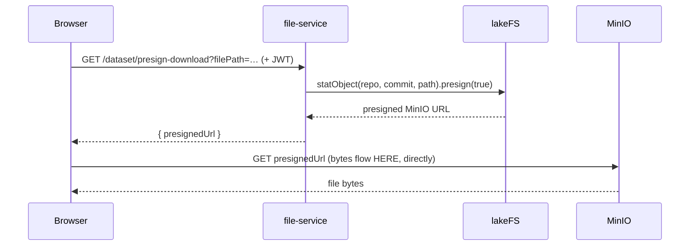
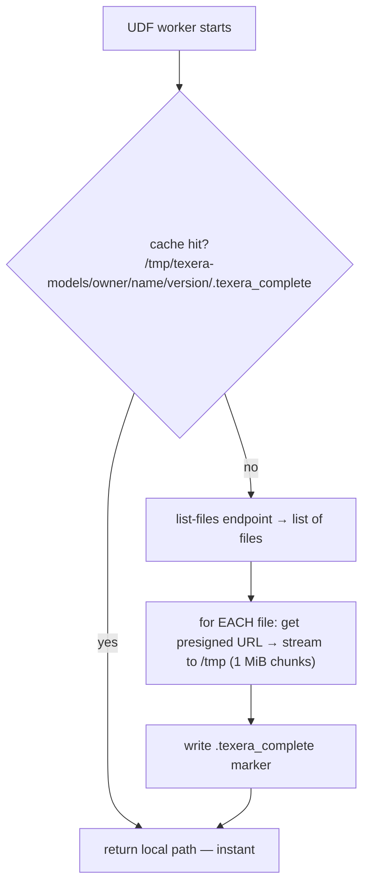

# Scalable Loading of Folder-Models in a Python UDF

_Plain-language walkthrough of how Texera stores and serves datasets/models today, why the current
"download the whole folder to the pod" approach doesn't scale to many models, and the realistic ways
to fix it — with the design change and the user experience for each. Codebase facts are anchored to
`file:line`; external facts are cited at the bottom (verified Jul 2026)._

---

## Part 1 — How Texera stores and serves a dataset/model today

### The one-sentence version
A model or dataset is just **a folder of files kept in lakeFS, whose bytes actually live in MinIO**.
lakeFS is the "git for data" layer that tracks versions; MinIO is the S3 bucket that holds the raw
bytes. When someone needs a file, Texera asks lakeFS for a **temporary direct download link to MinIO**
and hands that out — the bytes never flow through Texera's own services.

### Logical path → physical bytes (the mapping)

Everything the UI and UDFs talk about is a **logical path**:

```
/models/alice@uci.edu/tiny-sentiment/v1 - initial/model.safetensors
 └─type─┘└── owner ──┘└── name ────┘└─ version ─┘└─── file ───┘
```

Texera translates that into physical storage in three hops:

```mermaid
flowchart LR
  A["logical path<br/>/models/alice/tiny-sentiment/v1/model.safetensors"]
  B["lakeFS repo + commit<br/>repo = dataset-{did}<br/>commit = version_hash"]
  C["physical object in MinIO<br/>bucket texera-dataset/dataset-{did}/&lt;content-hash&gt;"]
  D["presigned URL<br/>(points straight at MinIO, 24h)"]
  A -->|FileResolver parses,<br/>DB lookup| B -->|lakeFS statObject| C -->|lakeFS .presign(true)| D
```

- **Each dataset/model = one lakeFS repository** named `dataset-{did}`, created at upload
  (`DatasetResource.scala:314`). Its bytes live under the MinIO bucket `texera-dataset` at
  namespace `s3://texera-dataset/dataset-{did}/…` (`LakeFSStorageClient.scala:72,145`).
- **Each version = one lakeFS commit** on the `main` branch. The commit id is saved in the DB
  column `dataset_version.version_hash` (`DatasetResource.scala:422`). Versions are **immutable** —
  which is why caching is easy (a version can never change under you).
- **`FileResolver`** parses the logical string, looks the repo + commit up in Postgres, and rewrites
  it to `dataset:///{repo}/{versionHash}/{relpath}` (`FileResolver.scala:95-194`). The
  `datasets` vs `models` prefix is just a label — both resolve identically; the real distinction is
  the `dataset.type` column (`DatasetResource.scala:304`).
- lakeFS stores objects **content-addressed** in MinIO (identical files are stored once), so the
  "physical address" is a hash key, not the human path.

### How a file reaches the user (two-hop, bytes go direct)



- **Listing** a version's file tree returns only **names/sizes/types**, no bytes
  (`rootFileNodes` → `retrieveObjectsOfVersion`, `DatasetResource.scala:1439-1478`).
- **Downloading** is the two-hop dance above: file-service returns a link, the **browser fetches
  bytes straight from MinIO** (`dataset.service.ts:92-99`). Texera never proxies the bytes (except the
  ZIP endpoint, which does stream through).
- A **JVM operator** reads a file the same way: `DatasetFileDocument.asInputStream()` gets a presigned
  URL and streams from MinIO over the network — no disk copy on the happy path
  (`DatasetFileDocument.scala:81-138`).
- **Auth:** app→lakeFS and app→MinIO use service credentials; the presigned URL carries its own signed
  permission (no token needed); the worker→file-service hop uses the **user's JWT**.

---

## Part 2 — How a folder-model loads in a Python UDF today (and why it doesn't scale)

When you pick a model in the UDF's **Model folder** field, Texera injects one line before your code
(`PythonUDFOpDescV2.scala:151-159`):

```python
texera_model_dir = ModelFolderDocument("/models/alice/tiny-sentiment/v1").download()
```

`download()` does this (`model_folder_document.py:152-196`):



- Bytes flow **MinIO → the worker's local `/tmp`**, one file at a time. Only the presign metadata
  touches file-service.
- The cache key is the **immutable version**, so the same model on the same pod downloads **once**.
- On a Kubernetes computing unit, the user JWT is injected into the pod
  (`ComputingUnitManagingResource.scala:461`); on a **hand-started local unit there is no JWT**, so it
  falls back to the **public** endpoints — that's why demo models must be public.

### Why it doesn't scale — the real problem (not what it looks like)

It's a common misread that "50 operators = 50 downloads." Actually the per-version cache means the
same model is fetched once per pod. The true costs are:

| Real cost | Why |
|---|---|
| **Per-pod duplication** | Each worker **pod** has its own `/tmp`. 50 models across P pods = up to `50 × P` full copies on disk. Nothing is shared between pods. |
| **Cold-start latency** | The *first* operator to touch a model on a given pod pays the **whole folder download** before it can run — tens of MB to tens of GB. |
| **No parallelism / no lock** | Files download **sequentially**, and two operators hitting a cold model on the same pod race with no coordination (`model_folder_document.py:163-170`). |
| **Disk pressure** | Big/sharded LLMs × many pods can blow the ephemeral disk. |

So the goal is: **one copy per cluster, fetched lazily, shared across pods and operators** — while
keeping the thing that makes the current design work: the model still has to look like **a real local
folder**, because `transformers.from_pretrained` / `pipeline`, TF SavedModel, and ONNX-with-external-data
all open sibling files by real filesystem path (they can't read from a remote handle).

---

## Part 3 — The options, with design + user experience

Four families, cheapest to most powerful. For each: the idea, the design change in Texera, what the
**user** experiences, and the catch.

### Option A — Shared cache volume (the quick win)

**Idea:** keep downloading, but into **one shared disk that every pod mounts**, instead of each pod's
private `/tmp`.

- **Design:** point `TEXERA_MODEL_CACHE_DIR` at a **ReadWriteMany** volume (NFS / AWS EFS / GCP
  Filestore / CephFS) mounted into all worker pods. Add three small fixes to `ModelFolderDocument`: a
  per-version **lock** (so concurrent cold starts don't double-download), **parallel** file downloads
  (a thread pool, like HuggingFace's 8 workers), and **content-addressed dedup** (store identical
  files once across versions, like the HF cache). Almost no architecture change.
- **User experience:** **identical to today.** Same "pick a model folder" flow. The *first* run of a
  model anywhere in the cluster still waits for the download; **every other run on every pod is
  instant**. This alone removes the per-pod duplication and most cold starts.
- **Catch:** it's still a full copy (once per cluster, not once per pod); NFS-class volumes can be slow
  on thousands of tiny files; you manage eviction (LRU/size cap) yourself.

### Option B — Mount the model folder read-only (lazy, no full copy)

**Idea:** make the versioned model folder **appear as a local directory** that's actually backed by
object storage. Files are pulled **on first read** and cached; nothing is bulk-downloaded. Because
`safetensors` uses **mmap**, multiple operators on the same node share the same memory pages — close to
**zero extra copies**.

- **Design:** mount object storage into the worker pod, then `ModelFolderDocument.download()` simply
  **returns the mount path** (no copying). Two OSS-friendly ways to get the *versioned* view:
  - **Via the lakeFS S3 Gateway (recommended).** lakeFS OSS exposes an S3-compatible endpoint where the
    path is `s3://<repo>/<ref>/<path>` — so a generic S3 mounter can mount a specific commit and it
    **honors lakeFS access control**. Mount it with **`mountpoint-s3`** (has a Kubernetes **CSI driver**,
    read-only mode, and a node-local cache shared across pods) pointed at the gateway via
    `--endpoint-url` + `--force-path-style`; `s3fs-fuse` or `rclone mount` also work. This is how you
    **replicate lakeFS's Enterprise "Mount" feature on open-source lakeFS** — the built-in
    lakeFS Mount (Everest) is **Enterprise/Cloud-only**.
  - **Bypass lakeFS and mount MinIO directly** — simplest to wire, but you lose lakeFS's permission
    checks and you must resolve the content-hash physical paths yourself. Only for a trusted
    single-tenant setup.
- **User experience:** **still identical** — you pick a model folder, `texera_model_dir` works exactly
  as before. The difference is invisible: the **first read is lazy** (a small per-file latency instead
  of one big upfront download), and re-use across operators/pods on a node is instant via the shared
  cache.
- **Catch:** FUSE over object storage is **slow on many tiny files** unless the cache is warm; mounts
  add an operational moving part; `mountpoint-s3` officially targets AWS S3 (works with MinIO/lakeFS
  gateway via `--endpoint-url` but isn't an AWS-supported config).

### Option C — A caching filesystem tier (JuiceFS / Alluxio)

**Idea:** like Option B, but with a **cluster-wide cache tier** so the first pod that reads a model
warms the cache for *all* nodes, and small-file performance is much better than raw FUSE.

- **Design:**
  - **Alluxio** sits **transparently in front of your existing MinIO/lakeFS** as a caching layer and
    exposes a POSIX mount — good fit for "cache the objects we already have," but its POSIX support and
    Kubernetes CSI are weaker/less-maintained.
  - **JuiceFS** gives full POSIX + excellent small-file performance + a first-class K8s CSI with local
    NVMe cache — **but it stores files in its own chunked format with a separate metadata database**
    (Redis/Postgres). That means models would live *in JuiceFS*, not as plain lakeFS objects, so it's a
    bigger commitment (a second source of truth) unless you make JuiceFS the model store.
- **User experience:** identical to Options A/B (pick a folder). Fastest warm reads of the mounted
  options, especially for many-small-file models.
- **Catch:** a new stateful service to run (metadata engine / master); JuiceFS changes where the bytes
  actually live.

### Option D — Serve the models instead of loading them (the at-scale answer)

**Idea:** stop loading models inside each UDF at all. Run a **model server** that loads each model
**once into memory** and answers inference requests over the network. For "dozens of models across many
operators," this is what large systems actually do.

- **Design:** deploy a serving layer and have the operator/UDF make an RPC instead of loading weights.
  - **NVIDIA Triton** with **EXPLICIT model-control** exposes a load/unload API and can pull its model
    repository from S3/MinIO — you build the "load on demand" logic on top.
  - **KServe ModelMesh** is the turnkey version: it manages a **distributed LRU cache of models across
    a pool of pods**, auto-loads on first request, and **evicts least-recently-used models when memory
    is full** — designed for **hundreds-to-thousands** of models. This directly matches your "50 models,
    many operators" worry: the bytes live **once** in the serving tier, not per operator or per pod.
- **User experience:** **this one changes the UX.** Instead of "pick a model folder + write load code,"
  the natural fit is a **no-code "Model Inference" operator** (Texera already prototyped Design B) that
  the user points at a registered model and input columns — it calls the server under the hood. No
  per-operator model load, no cold-start download, and the same model shared by every operator
  instantly. Power users can still drop to a UDF that calls the endpoint.
- **Catch:** a real service to operate; inference now crosses a network boundary (serialization
  overhead, batching considerations); best when models are reused a lot (which is exactly the 50-models
  case).

### How the ecosystem solves the same problem (patterns worth copying)
- **HuggingFace Hub `snapshot_download`** — downloads a whole revision into a local dir, **content-
  addressed cache keyed by the immutable commit**, parallel downloads, completeness-checked before
  reuse. Texera's `ModelFolderDocument` is a simpler version of this; Option A just finishes the job.
- **MLflow `download_artifacts` / DVC `pull`** — both **materialize to a local path, cached**; DVC adds
  reflink/hardlink dedup. Same "materialize + cache + dedup" pattern as Option A.

---

## Part 4 — Comparison and recommendation

| | Copies of bytes | First-use latency | Many small files | New infra | UX change | Multi-tenant auth |
|---|---|---|---|---|---|---|
| **Today** (`/tmp` per pod) | 1 per pod per version | full download | ok | none | — | JWT (k8s) / public (local) |
| **A. Shared cache** | 1 per **cluster** | full download once | ok–slow (NFS) | RWX volume | none | inherits current |
| **B. Lazy mount** (lakeFS gateway + mountpoint-s3) | lazy pages, shared on node | near-zero | ⚠️ slow unless cached | FUSE/CSI | none | **lakeFS RBAC via gateway** |
| **C. JuiceFS/Alluxio** | lazy + cluster cache | near-zero | ✅ good | metadata svc | none | via FS layer |
| **D. Model server** (ModelMesh) | 1 in server memory | model load once | n/a | serving svc | **new operator** | at the service |

**Tiered recommendation for OSS lakeFS + MinIO + Kubernetes:**

1. **Quick win (days):** Option A — shared RWX cache + a download lock + parallel fetch + content-
   addressed dedup. ~80% of the pain (per-pod duplication, most cold starts) gone, zero UX change,
   minimal code in `ModelFolderDocument`.
2. **Medium (weeks):** Option B — read-only lazy mount through the **lakeFS S3 Gateway** with
   `mountpoint-s3` (its CSI driver) or Alluxio. This is the open-source replica of lakeFS Enterprise
   Mount, keeps the "local folder" contract and lakeFS permissions, and makes cold start near-instant.
   `download()` becomes "return the mount path."
3. **At real scale (project):** Option D — a **ModelMesh/Triton** serving tier plus a no-code Model
   Inference operator, so models load once and are shared by every operator. This is the endgame when
   many models are reused across many workflows, and it aligns with the MLflow direction in #4198.

A pragmatic path is **A now**, **B when cold-start/disk hurts**, **D when model reuse is high enough to
justify a serving tier** — they stack rather than replace each other.

---

## Sources (verified Jul 2026)
- lakeFS Mount (Everest) is Enterprise/Cloud-only: https://docs.lakefs.io/reference/mount/ ,
  https://lakefs.io/open-source-vs-enterprise/ , Mount CSI (Everest): https://docs.lakefs.io/v1.60/reference/mount-csi-driver/
- lakeFS S3 Gateway (OSS, S3-compatible; works with s3fs/rclone/AWS SDK + custom endpoint):
  https://docs.lakefs.io/reference/s3.html ; lakeFS vs S3 Mountpoint: https://lakefs.io/blog/amazon-s3-mountpoint-vs-lakefs-mount/
- Mountpoint for S3 custom endpoint (`--endpoint-url`, `AWS_ENDPOINT_URL`, `--force-path-style`):
  https://github.com/awslabs/mountpoint-s3/blob/main/doc/CONFIGURATION.md
- Mountpoint S3 CSI driver (static provisioning, ReadOnlyMany, node-local cache; v2 shared cache):
  https://github.com/awslabs/mountpoint-s3-csi-driver , https://aws.amazon.com/blogs/storage/mountpoint-for-amazon-s3-csi-driver-v2-accelerated-performance-and-improved-resource-usage-for-kubernetes-workloads/
- JuiceFS vs Alluxio (small-file perf, POSIX, K8s CSI, metadata engine):
  https://juicefs.com/docs/community/comparison/juicefs_vs_alluxio/
- Triton EXPLICIT model control (load/unload API, S3 repo):
  https://github.com/triton-inference-server/server/blob/main/docs/user_guide/model_management.md
- KServe ModelMesh (distributed LRU cache, auto load/unload, thousands of models):
  https://kserve.github.io/website/docs/admin-guide/modelmesh , https://www.ibm.com/opensource/blogs/kserve-and-watson-modelmesh-extreme-scale-model-inferencing-for-trusted-ai/
- HuggingFace Hub cache (content-addressed, revision-keyed): https://huggingface.co/docs/huggingface_hub/guides/download
