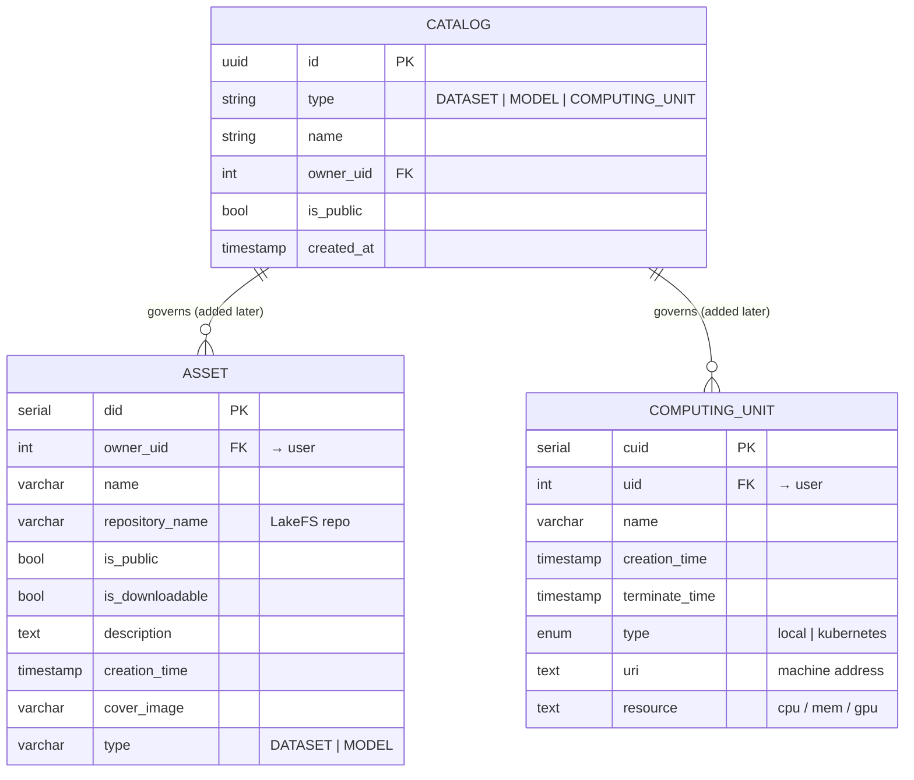

# Proposed Texera catalog — ER diagram + discussion comment

## Discussion comment (ready to paste)

> ## Proposal: a catalog over typed resources
>
> We'd put Texera's resources under one catalog: an **`asset`** table (datasets & models — our
> current `dataset` table kept as‑is, discriminated by `type`) and the existing **`computing_unit`**
> table, with a shared **`catalog`** parent added in a later phase for unified listing, sharing, and
> permissions.
>
> This follows a pattern shared by three production data systems we studied:
> - one governs many asset types (files, tables, models) under a single catalog, with metadata kept
>   separate from where the bytes live;
> - one registers **compute** as a first‑class resource with its own on/off lifecycle, decoupled from
>   storage;
> - one unifies assets and their compute under one catalog with pluggable storage and execution.
>
> The common takeaway — **one catalog over typed resources, storage separate from compute** — is what
> this adopts. Nothing is rewritten now: `asset` is just the renamed `dataset` table and
> `computing_unit` is unchanged; the only new piece is the shared `catalog`, added later.
>
> ER diagram below — feedback welcome.

---

## ER diagram

**Notes**
- **`ASSET` = today's `dataset` table, just renamed** — same columns; **dataset & model live in this
  one table**, discriminated by the existing `type` column (`DATASET | MODEL`). A new asset type later
  (e.g. `VENV`) is a new `type` value, not a new table. *(No version table shown here for now.)*
- **`COMPUTING_UNIT` = today's `workflow_computing_unit` table** — unchanged (`type` enum is
  `'local' | 'kubernetes'`).
- **`CATALOG` is introduced later** (phase 2) as a shared parent so *listing, search, sharing, and
  permissions* work uniformly across assets **and** computing units; it adds a `catalog_id` FK to both.
- **Storage stays separate from compute:** file assets resolve to **LakeFS/MinIO** (results → Iceberg)
  via presigned URLs; a `COMPUTING_UNIT` is resolved by its **own** lifecycle handler, never the
  file/storage path.
