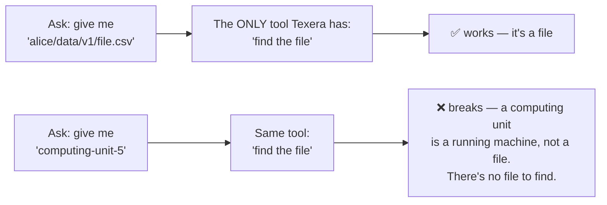
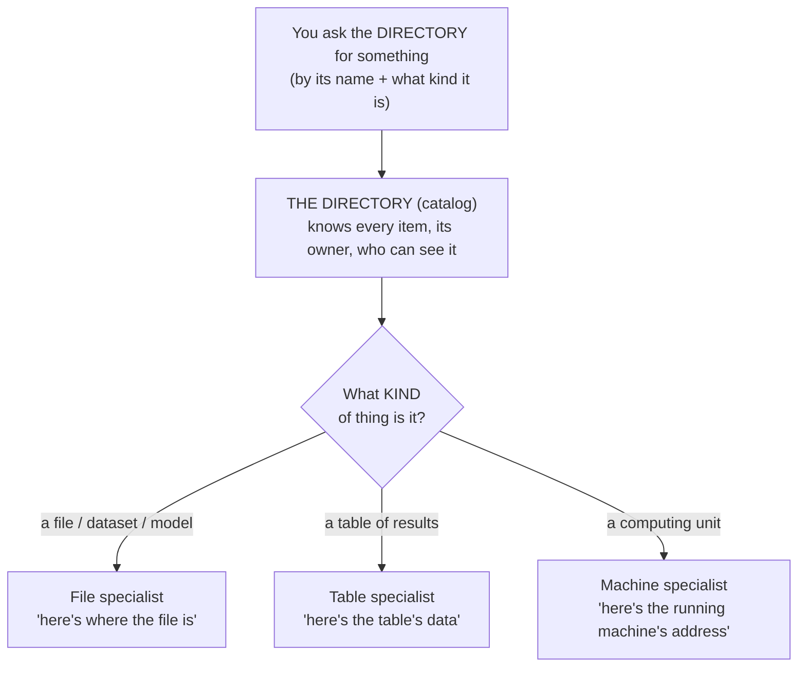
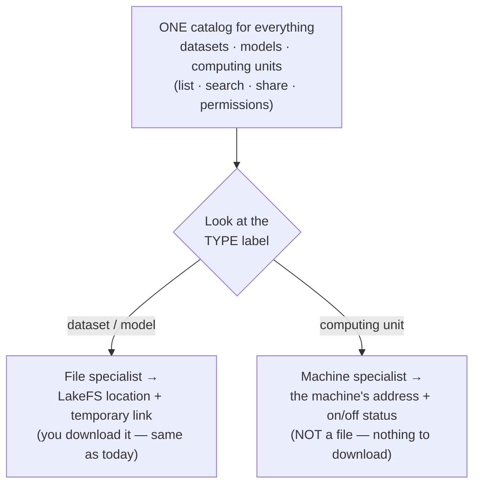

# How to Manage Many Kinds of Things in One Place (Simple Explainer)

_Plain-language version of the research. Goal: explain how big systems organize different kinds of
resources, and what Texera should copy — so a non-technical reader gets it and can re-explain it._

---

## The problem, in one picture

Today Texera finds things **one way**: you give it a file path, it finds the file and hands it back.
That works great for **datasets** (and models — they're files too). But a **computing unit** isn't
a file — it's a *running machine*. So the "go find the file" trick doesn't work for it.

We need a smarter, more general way to manage **different kinds** of things — not just files.

---

## How the big systems solve it — the "hotel concierge" idea

Every system we looked at (Unity Catalog by Databricks, Apache Gravitino, Google's GOODS) uses the
**same idea**. Think of a **hotel concierge**:

- There's **one front desk** (call it the **catalog** / directory). It knows about *everything* —
  your room, a taxi, a dinner reservation — who it belongs to, and who's allowed to use it.
- But the concierge **doesn't handle all requests the same way**. A taxi request goes to the valet;
  a dinner request goes to the restaurant; a room request goes to housekeeping. **One front desk,
  many specialists.**

That's the whole trick: **one directory that lists everything, plus a specialist for each *kind* of
thing.** The directory doesn't try to fetch everything itself — it points each request to the right
specialist.

In tech words (just so you recognize them): the **directory** is called a *catalog*, and each
**specialist** is called a *resolver* (or *handler*). But "front desk + specialists" is all you need
to remember.

---

## What each system actually does (and its API), in plain words

All four follow the "front desk + specialists" idea, but each has its own flavor. Here's each one
simply — plus the kind of **API** (the commands you send it) it offers.

**Unity Catalog (Databricks)** — the biggest example.
- *What it manages:* tables, files (it calls these **"volumes"**), functions, and models — all in
  one directory, each with a "type" label.
- *Its API:* you send simple "create a table / create a volume / create a model" commands (like
  filling in a form). When you actually want the data, you call a special command that returns
  *"here's the storage address + a temporary key"* — and you go fetch it yourself. **The directory
  never sends the data.**
- *Key point:* files, tables, and volumes each have their **own** "give me access" command —
  different specialists.
- *Compute* (running machines) is **not** in this directory — handled separately.

**Apache Gravitino** — the closest to what Texera wants.
- *What it manages:* tables, files ("filesets"), models, message streams — one directory, a type
  per item.
- *Its API:* create/list items. For files, it gives you a friendly **"virtual path"** (like
  `gvfs://myfiles/...`) plus a translator that turns it into the real storage location when you open
  it. Users see a clean path; the system quietly maps it to wherever the bytes really live.
- This is *almost exactly* Texera's current "logical path → real file" idea — just generalized to
  work for many types.

**Google GOODS** — the odd one (useful as contrast).
- It doesn't ask anyone to register anything. It **automatically scans** Google's storage and builds
  the directory afterward.
- Each item's name starts with a tag saying which storage it lives in (`/bigtable/...`, `/gfs/...`);
  that tag picks the specialist.
- *Lesson for us:* we'll **register on upload** (we control uploads), not auto-scan — but "the name
  tells you the type/where" is the same idea.

**Delta Lake** — just for tables.
- For a table it keeps a **"logbook"** of changes; to read the table it replays the logbook to know
  which files make it up. The directory only says "this table's logbook is here."

**The common thread:** create/list items with simple commands; to read, you get a *"location + key"*
and fetch it yourself; and **each type has its own way** of being fetched.

---

## The 3 simple rules they all follow

1. **One directory for everything.** All kinds of things (files, tables, models, machines) are
   listed in one place, so you can search them, share them, and control who sees them — the same way
   for all.

2. **A different specialist for each kind.** Getting a file, getting a table, and pointing to a
   machine are *different jobs*. Each kind of thing has its own specialist that knows how to do it.
   (There is **no** single method that works for all of them — and that's fine, that's the point.)

3. **The directory hands you a "where + a key," not the thing itself.** It doesn't carry the heavy
   data. It says "the file is over there, here's a temporary key to open it," and you go get it
   directly. **Texera already works this way** (it hands out temporary download links) — so this
   part is already correct.

**One more important finding:** none of these systems treat a *running machine* (compute) as a file.
Compute is always handled separately. So a computing unit can be **listed** in the directory (so you
can see it and share it), but it gets the **machine specialist**, never the file specialist.

---

## What this means for Texera (the recommendation)

Right now Texera basically has **one specialist who only knows files.** The fix is to give it a
**team of specialists — one per kind of thing** — with the directory picking the right one based on
a simple "type" label on each item.

- **Datasets and models** keep working exactly as today (they're files → file specialist).
- **Computing units** get added to the same directory (so they show up and can be shared), but they
  use the **machine specialist** — because they're not files.
- Adding a **new kind of thing** later just means: add a new "type" label + a new specialist. The
  directory doesn't change.

This is exactly what Databricks' Unity Catalog, Apache Gravitino, and Google's GOODS do. So Texera
wouldn't be inventing anything risky — it would be following the well-proven pattern.

---

## How to explain it to someone in 20 seconds

> "Think of a hotel concierge. One front desk knows about everything — but a taxi, a dinner booking,
> and your room key are each handled by a different specialist. Texera today only has one
> specialist: 'find the file.' That works for datasets and models because they're files — but a
> computing unit is a running machine, not a file, so it breaks. The fix is a team of specialists,
> one per kind of thing, behind one front desk. That's how Databricks, Google, and Apache Gravitino
> all do it."

## Mini-glossary (plain words)

| Tech term | Plain meaning |
|---|---|
| **Catalog** | the front desk / directory that lists everything and who can use it |
| **Resolver** / **handler** | a specialist that knows how to fetch one *kind* of thing |
| **Resource / asset / securable** | any "thing" in the directory (a dataset, a model, a machine) |
| **Type** | the label that says what kind a thing is, so the right specialist is picked |
| **Credential / temporary link** | the "key" the directory hands you to go get the data yourself |
