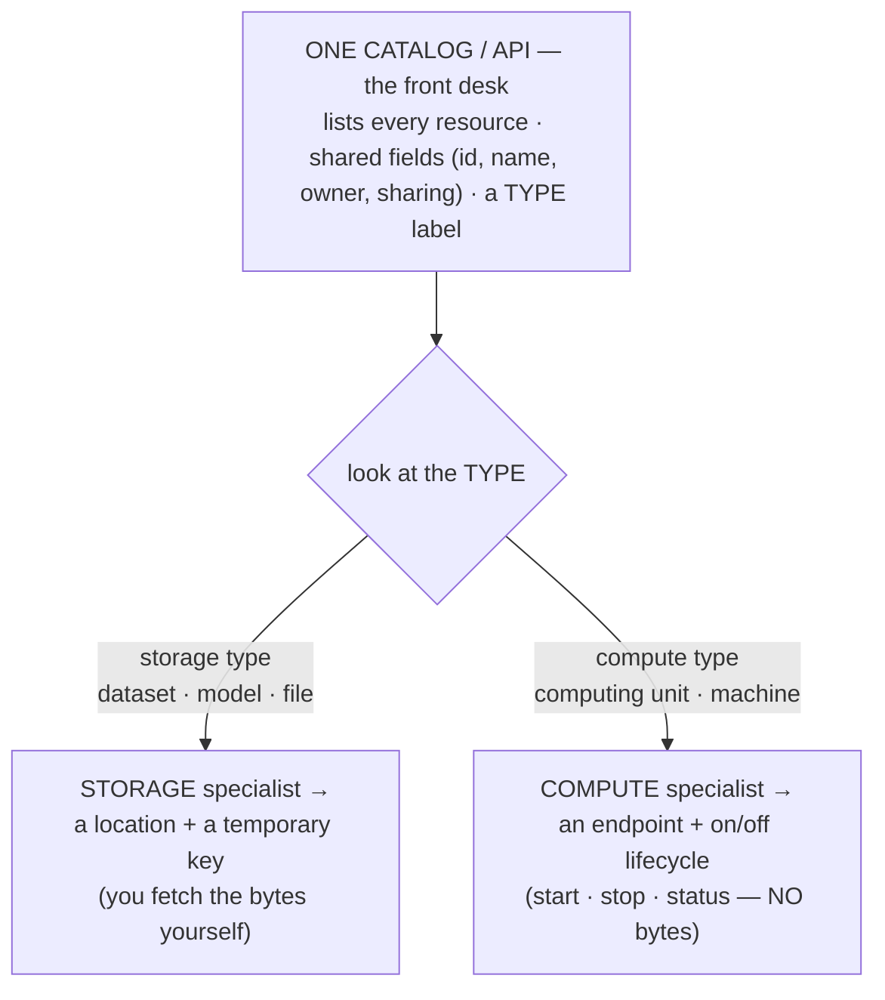
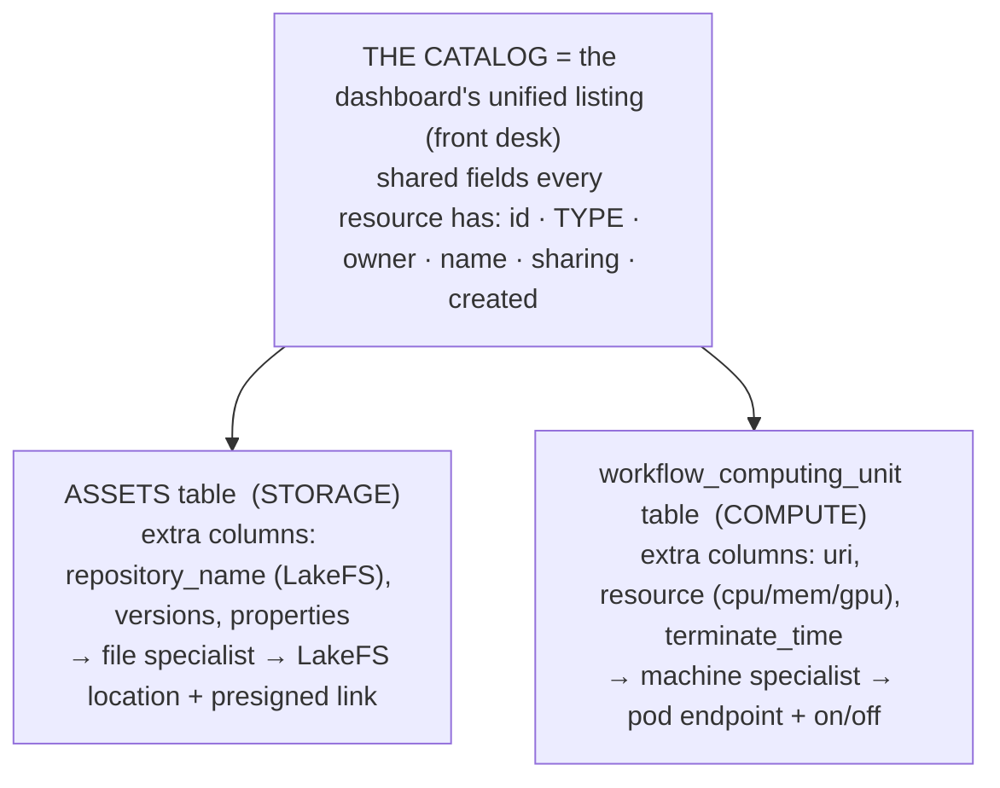
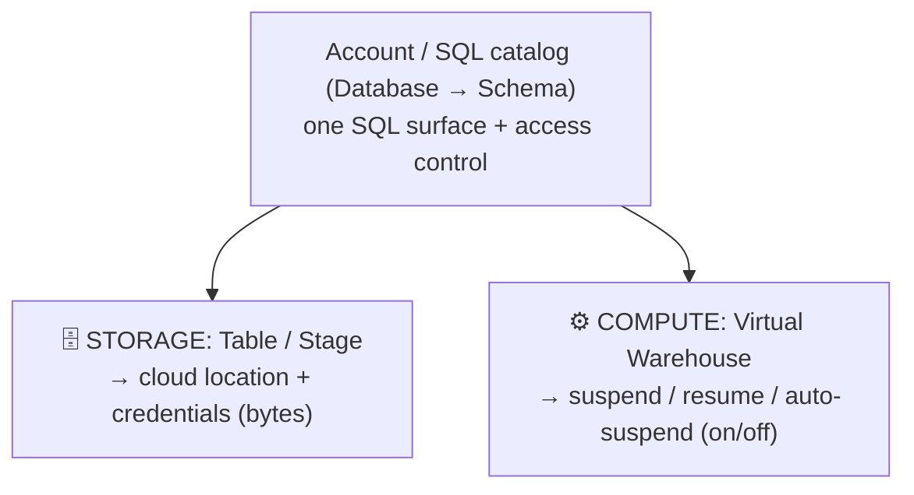
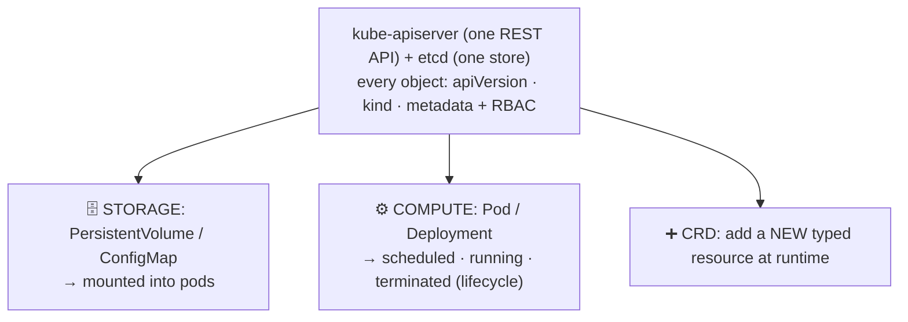
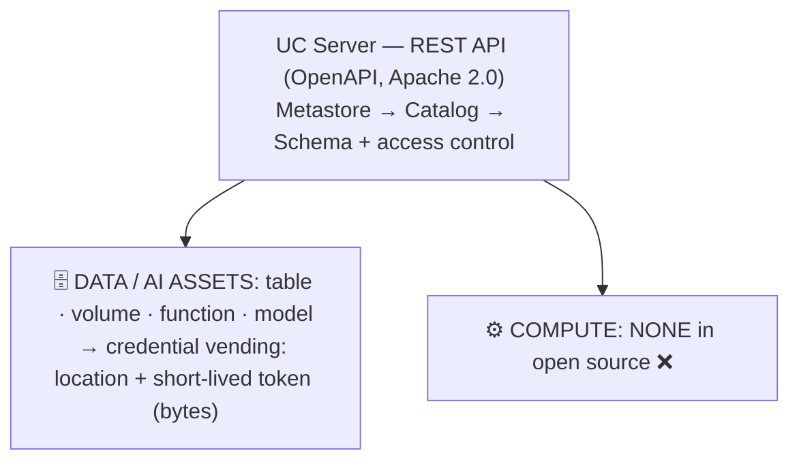
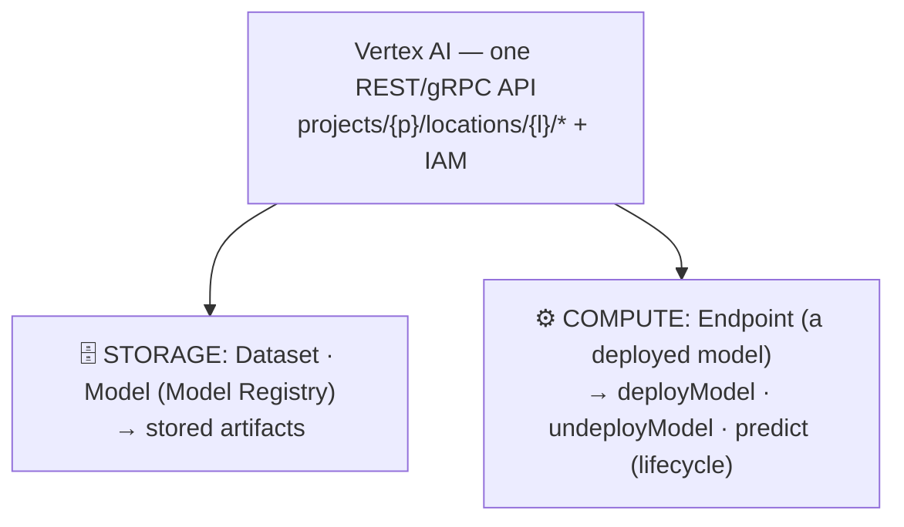
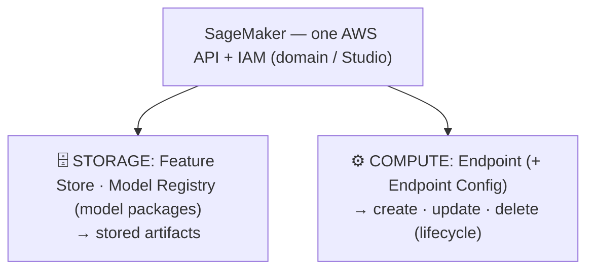

# One Catalog Over Storage AND Compute — Systems + How Texera Does It

_Plain-language. Shows the API + storage + compute pattern these systems share (with a diagram),
adds more systems we found, and answers concretely how "compute separate from storage" looks in
Texera — including in the database._

---

## The pattern in one picture

The "front desk" (catalog) lists **everything**. But it hands off **storage** and **compute** to
**different specialists** — because they're fetched in totally different ways.



The rule everyone follows: **storage resolves to "where + a key"; compute resolves to "an address +
on/off."** Same front desk, different specialist.

---

## The systems (what's storage, what's compute, how each is fetched)

| System | Storage resource | Compute resource | How they're kept separate |
|---|---|---|---|
| **Snowflake** ✅ *(the textbook case)* | **Tables / Stages** — a stage points to a cloud location + credentials → bytes | **Virtual Warehouse** — a compute cluster with **suspend / resume / auto-suspend** | Both are account objects under one SQL catalog, but created by **different commands** (`CREATE TABLE`/`CREATE STAGE` vs `CREATE WAREHOUSE`) and warehouses have an **on/off lifecycle** tables don't |
| **Kubernetes** ✅ *(the purest example)* | PersistentVolume / ConfigMap | **Pod** (a running container) | **Everything is a typed object** under one API server, sharing a common envelope (`kind` + `metadata`), all in **one store (etcd)**. A **new type is added at runtime with a CRD** — no rebuild. Directly analogous to Texera adding an asset type. |
| **Hugging Face Hub** ✅ | **Model / Dataset repos** (files) | **Spaces** (a running app) | All three are **git repos** sharing namespace + permissions, but a Space adds compute (hardware tier, sleep/wake) on top |
| DataHub / OpenMetadata *(not fully verified this pass)* | datasets, dashboards | pipelines, "services" | one generic entity model spanning data + compute-ish entities |
| Unity Catalog `SERVICE` *(not fully verified this pass)* | table / volume / model | serving endpoint (`SERVICE`) | endpoint gets its own securable type + resolver, not the storage one |

**The two we can fully stand behind — Snowflake and Kubernetes — are also the most useful:**

- **Snowflake** proves the exact split you want: *storage and compute are separate object types under
  one catalog*, and **only compute has an on/off lifecycle** (suspend/resume/auto-suspend). A table
  is never "started"; a warehouse is. That's the core difference between your assets and your
  computing units.
- **Kubernetes** proves the *extensibility* half: one API, everything is a typed object, and you can
  **add a brand-new type at runtime (a CRD) without touching the core**. That's your "add a new asset
  type without rebuilding" goal, already battle-tested at huge scale.

*(One honest note the research flagged: k8s and Snowflake both use essentially **one underlying
store** with a type label, rather than physically separate tables. More on that below — it doesn't
change Texera's plan, but it's worth knowing.)*

---

## How this looks in Texera — including the database

You already have both halves; the job is to put one **catalog/listing** over them and give each its
own **specialist**.



### In the database, concretely

Two **separate typed tables** that **share a common set of catalog columns** and then diverge:

```
COMMON catalog columns (both tables have these):
   id · owner · name · sharing (via *_user_access) · creation_time · TYPE

assets table  (STORAGE)                 workflow_computing_unit table  (COMPUTE)
├── type = DATASET | MODEL | VENV        ├── type = local | kubernetes
├── repository_name   (LakeFS repo)      ├── uri            (the machine's address)
├── versions          (version table)    ├── resource       (cpu / mem / gpu limits)
├── properties (JSON: framework, …)      ├── terminate_time (the on/off lifecycle)
└── → resolves to LakeFS + presigned URL └── → resolves to a pod endpoint (no bytes)
```

- **Shared at the top:** id, owner, name, sharing, type — so both show up in the same list, with the
  same permissions model. This is the "front desk."
- **Different below:** a storage row has a **LakeFS repo + versions**; a compute row has a **URI +
  resource limits + a terminate time** (its on/off lifecycle). Storage has no "on/off"; compute has
  no "bytes." That difference **is** the compute-vs-storage separation, made concrete in columns.
- **Resolved differently:** an assets row goes through the **file specialist** (→ LakeFS + link); a
  computing-unit row goes through the **machine specialist** (→ endpoint + status).

### One table or two? (the nuance)

The big systems mostly use **one store with a type label** (Kubernetes = one etcd; Snowflake = one
metadata layer). Texera is fine using **two tables** here, for a good reason: your **computing units
already have their own table and flow**, and they're a genuinely different shape (no bytes, no
versions, a runtime lifecycle). Forcing them into the `assets` table would mean lots of empty
columns. So:

- **Storage assets** (dataset/model/venv) → **one shared `assets` table** (they're the same shape).
- **Computing units** → **keep their existing `workflow_computing_unit` table** (different shape).
- **The "catalog" is the unified listing on top** (the dashboard) — not a single physical table.

That matches the principle exactly: *one catalog (front desk), typed resources, per-type specialists*
— whether it's one physical table or two is just an implementation detail, and two is the pragmatic
choice given what Texera already has.

---

## Each system drawn in the Texera style (catalog on top → storage + compute below)

Same shape as the Texera diagram: a **control plane / catalog on top**, then a **storage** resource
and a **compute** resource below, with how each resolves.

### Snowflake


### Kubernetes


### Unity Catalog — OPEN SOURCE  ⭐ (the prof's focus)

**The honest, prof-relevant answer:** open-source Unity Catalog is a **pure catalog/governance
layer** — it manages **data + AI assets** (tables, volumes, functions, **models**) under one
three-level namespace + REST API, and resolves storage to bytes via **credential vending** (in OSS
since v0.2). It **does not run or govern compute.** The compute-like piece — the **`SERVICE`
securable** (Model Services = invocable LLM endpoints, MCP Services) — is **Databricks-only, not
OSS.** So OSS UC maps *exactly* onto the **catalog table layer** in your Texera design; Texera then
adds the **compute (computing units)** that UC OSS deliberately leaves out.

### Google Vertex AI


### AWS SageMaker  _(analogous — not separately verified this pass)_


### Who actually RUNS compute?

| System | Runs compute (on/off lifecycle)? |
|---|---|
| Snowflake | ✅ warehouses (suspend/resume) |
| Kubernetes | ✅ pods (schedule/run/terminate) |
| Vertex AI | ✅ endpoints (deploy/undeploy) |
| SageMaker | ✅ endpoints (create/delete) |
| **Texera** | ✅ **computing units (pods)** |
| **Unity Catalog OSS** | ❌ **governance only — no compute** |

**The line for the prof:** *"Unity Catalog open source is exactly the catalog/governance layer — one
REST API over tables, volumes, functions, and models, resolving storage via credential vending, with
no compute. That's precisely the 'shared catalog table' layer in our design. Snowflake, Kubernetes,
and Vertex AI show the other half — running compute as a typed resource with an on/off lifecycle —
which is what Texera's computing units already do. So our design = UC-style governance layer + a
compute layer, under one catalog."*

---

## The 30-second version to tell someone

> "Snowflake and Kubernetes both prove the pattern: one catalog lists everything, but storage and
> compute are different resource *types* fetched by different specialists — storage gives you a
> location + a key, compute gives you an address you can turn on and off. In Texera that's two tables
> — an `assets` table for storage (datasets/models) and the existing computing-unit table for compute
> — sharing common fields (id, owner, name, sharing) and shown in one list. Storage rows resolve to
> LakeFS files; compute rows resolve to a running pod. Kubernetes even lets you add a new type at
> runtime, which is exactly our 'add a new asset type without rebuilding' goal."

## Honesty note on sources
- **Snowflake** and **Kubernetes** are deeply verified against primary docs (unanimous).
- **Hugging Face Hub**: the "all three are git repos" part is verified; the Spaces compute details are
  reported at medium confidence.
- **DataHub, OpenMetadata, Unity Catalog `SERVICE`**: these fit the pattern from general knowledge but
  **did not get verified in this pass** — treat them as "also worth a look," not established here. Can
  run a dedicated pass on them if useful.
