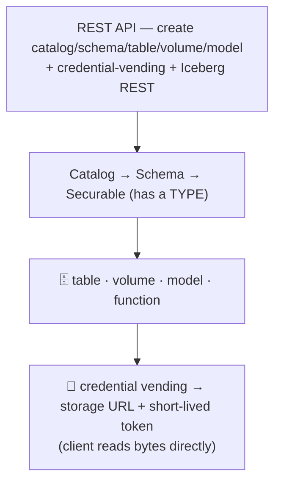
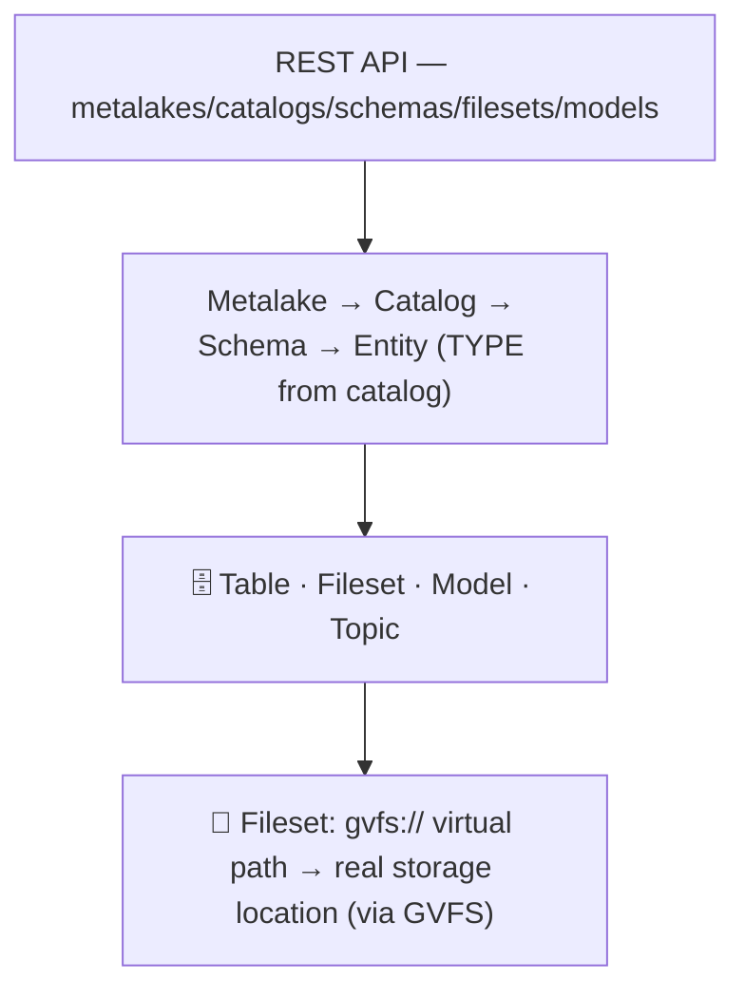
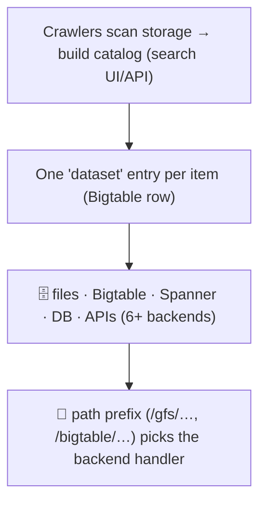
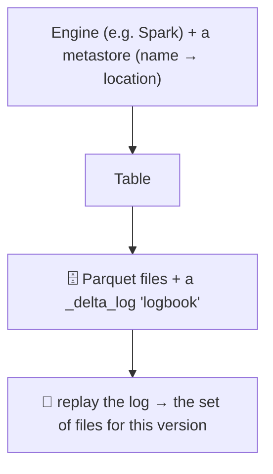
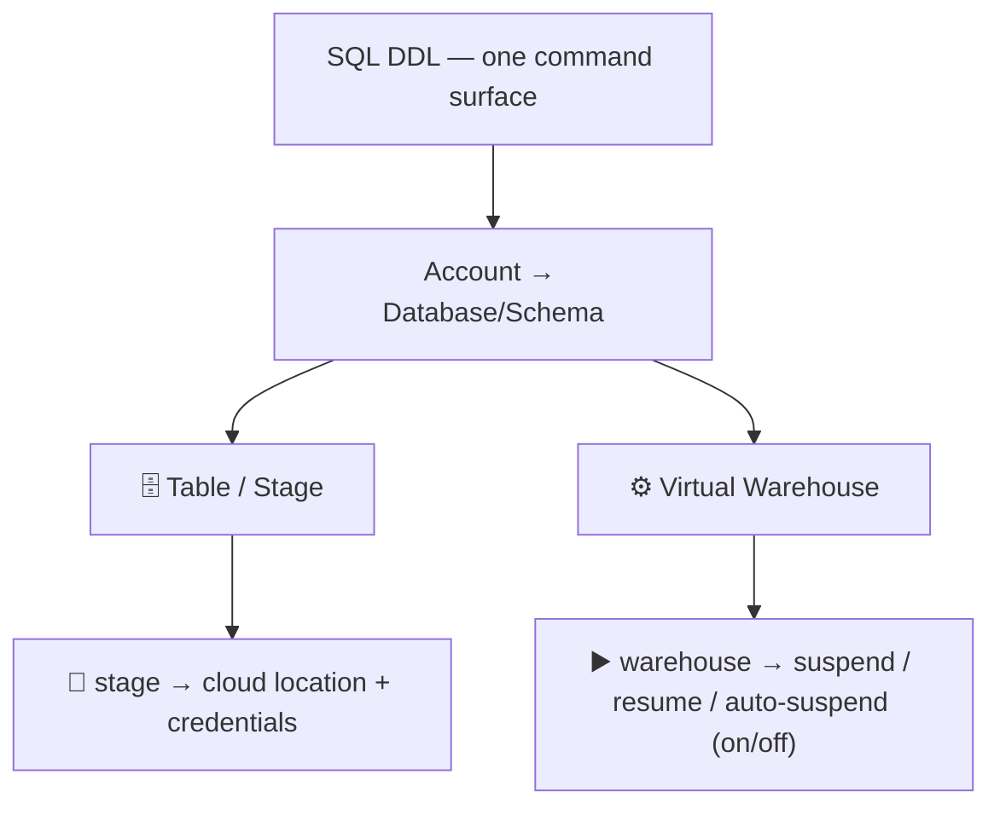
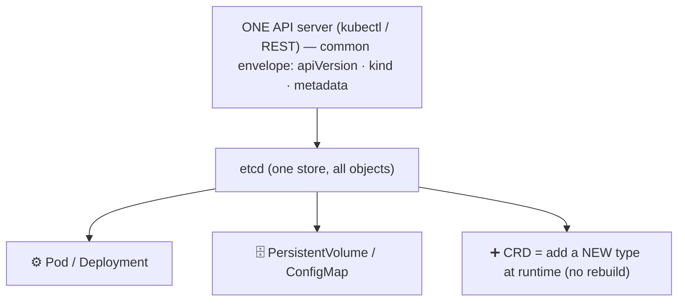
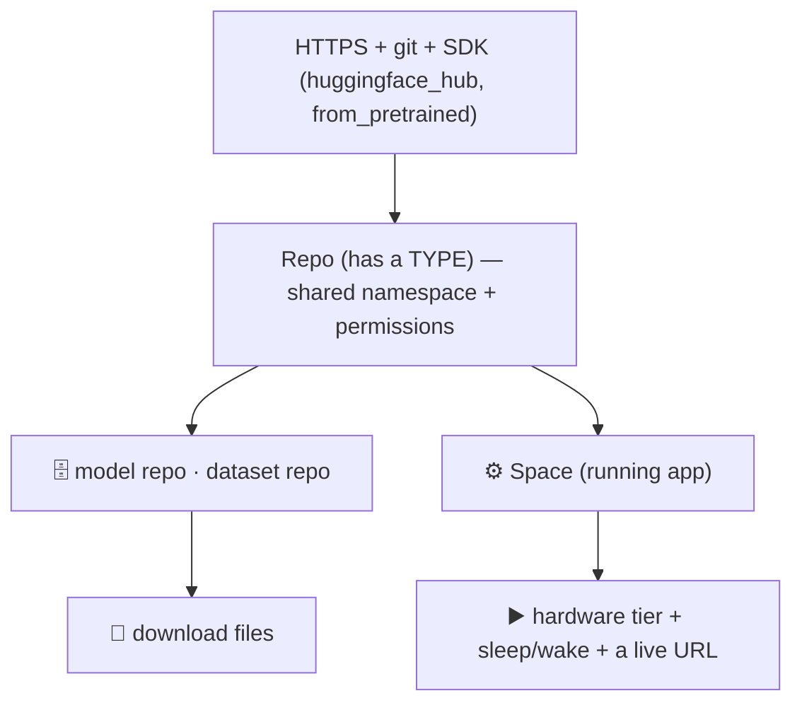
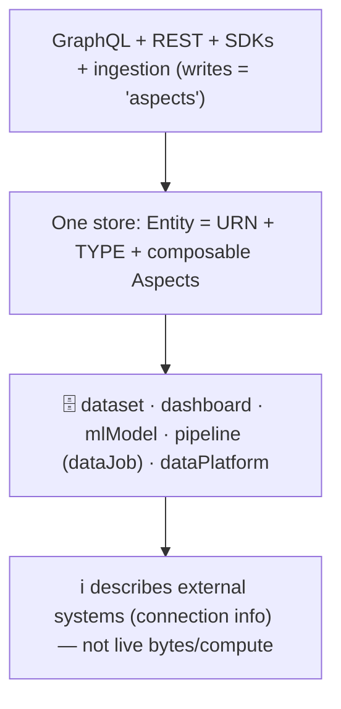
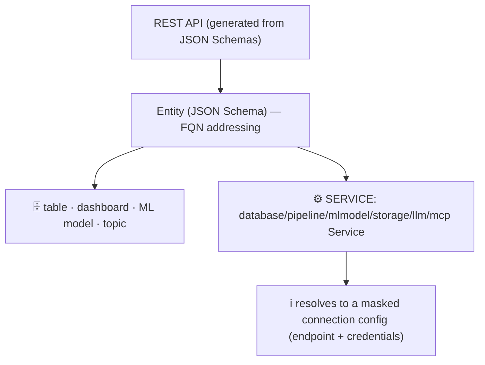

# The Systems at a Glance — Simple Diagrams + High-Level APIs

_One small diagram per system we researched: what it manages, how you get the actual thing, and the
kind of API it offers. Read top-to-bottom: **API → what it lists → how you fetch it.**_

Legend: 🗄️ = storage/data resource · ⚙️ = compute resource · 🔑 = "location + key" · ▶️ = "endpoint + on/off"

---

## Unity Catalog (Databricks)
Data governance catalog. Lists tables, files (volumes), functions, models. Never sends data — gives
you a location + a temporary key.

**API:** REST (+ SQL). **Compute?** not in the catalog (a new `SERVICE` type for serving endpoints is
the one exception — unverified here).

## Apache Gravitino (closest to Texera)
Unified metadata catalog for data + AI assets. Files get a friendly virtual path.

**API:** REST + GVFS (a Hadoop-style file system). **Compute?** no — metadata for data/AI assets only.

## Google GOODS
Auto-built catalog (crawls storage, no registration). The name's prefix says where it lives.

**API:** internal search/catalog (crawl-driven). **Compute?** no.

## Delta Lake / Lakehouse
Table format over a cheap object store. The catalog just maps a table name to its "logbook."

**API:** engine/library + metastore. **Compute?** no (compute is the engine reading it).

## Snowflake  ⭐ (the storage-vs-compute textbook case)
One SQL account holds both data objects and compute objects — as **different types**.

**API:** SQL (`CREATE TABLE` / `CREATE STAGE` vs `CREATE WAREHOUSE`). **Compute?** YES — a separate
object type, and **only it has an on/off lifecycle**.

## Kubernetes  ⭐ (the "everything is a typed resource" case)
One API server, one store (etcd). Compute and storage are both typed objects; add new types at runtime.

**API:** one REST API, everything is a `kind`. **Compute?** YES — Pods are compute, PVs are storage,
same envelope. **New type:** a CRD (directly analogous to Texera adding an asset type).

## Hugging Face Hub
Everything is a git repo — models/datasets (storage) and Spaces (running apps = compute).

**API:** REST/git + SDK. **Compute?** YES — Spaces are compute, sharing the same repo substrate.

## DataHub
Metadata catalog. One generic **Entity + Aspect** store; a new type is a registry entry, not a table.

**API:** GraphQL + OpenAPI/REST; addressing = **URN**. **New type:** add to `entity-registry.yml` +
rebuild. **Compute?** cataloged as *metadata about* external systems, not live compute.

## OpenMetadata
Schema-first catalog. Every entity is a JSON Schema; **SERVICE** entities are first-class.

**API:** REST; addressing = **FQN**. **New type:** add a JSON Schema (+ enum/connection). **Compute?**
services are first-class, but as *connection info to external systems*, not live compute.

---

## All systems at a glance

| System | High-level API | Resource types | Storage resolves to | Compute in the catalog? | Add a new type by… |
|---|---|---|---|---|---|
| **Unity Catalog** | REST + SQL | table, volume, model, function | location + token | mostly no (new `SERVICE`) | new securable type (server) |
| **Gravitino** | REST + GVFS | table, fileset, model, topic | gvfs:// → storage location | no | new catalog provider |
| **GOODS** | crawl + search | one "dataset" over 6+ backends | path prefix → backend | no | new crawler |
| **Delta/Lakehouse** | engine + metastore | table | log replay → files | no | — |
| **Snowflake** ⭐ | SQL | table/stage + **warehouse** | stage → location + creds | **yes (on/off)** | new object type (vendor) |
| **Kubernetes** ⭐ | one REST API | pods, volumes, configmaps… | volume claim | **yes (Pods)** | **a CRD (runtime)** |
| **Hugging Face** | REST/git + SDK | model, dataset, **Space** | file download | **yes (Spaces)** | (fixed 3 repo types) |
| **DataHub** | GraphQL + REST | dataset, mlModel, pipeline, platform | (describes external) | as metadata only | registry YAML + rebuild |
| **OpenMetadata** | REST | table, ML model, **services** | (connection config) | as metadata only | JSON Schema + rebuild |

**Two big takeaways:**
1. **Everyone uses one catalog + a TYPE label + a per-type way to fetch.** No one uses a single
   universal fetch method.
2. **Only Snowflake, Kubernetes, and HF actually run compute** (on/off lifecycle). DataHub &
   OpenMetadata only *describe* compute (connection info) — they don't run it. **Texera's computing
   units already run (real pods), so Texera is closer to Snowflake/Kubernetes than to the
   describe-only catalogs.**
