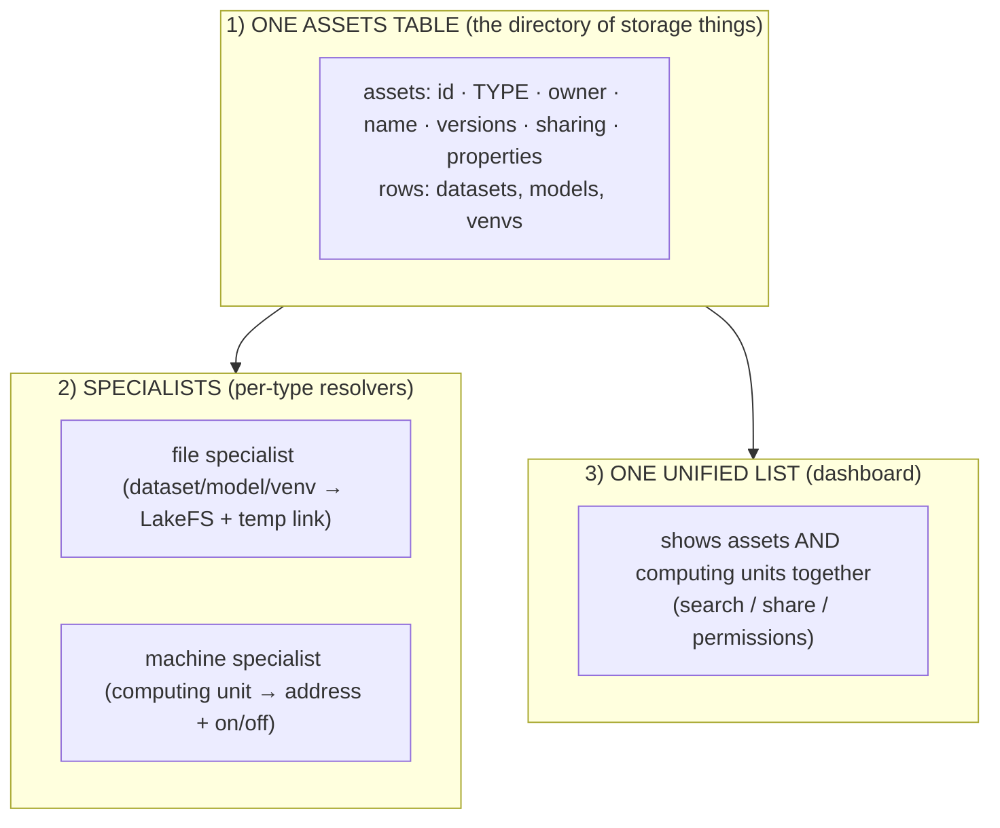
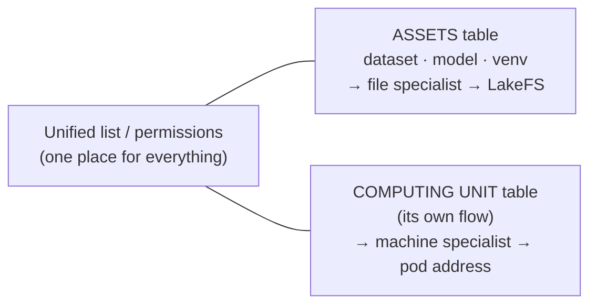
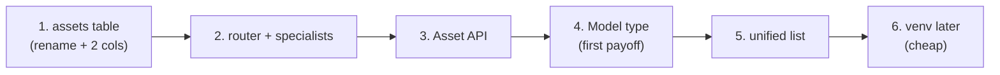

# How Texera Adopts the "One Directory, Many Specialists" Idea

_Plain-language plan. How Texera turns its dataset-only system into a general asset system, how
computing units fit, what APIs to offer, how a future `venv` slots in, and how big the change is._

---

## What Texera would be able to do afterward

- **Upload, version, share, and list any kind of storage asset** — datasets, models, and later
  venvs — through **one** system, the same way.
- **Use each kind its own way** — a model gets loaded, a dataset gets read, etc. (each has its
  specialist).
- **See computing units in the same place** as everything else (one unified list), even though they
  run as machines, not files.
- **Add a brand-new kind of asset later without rebuilding** — just a new label + a new specialist.

---

## The 3 building blocks

### Block 1 — rename `dataset` table → `assets` table (+ 2 columns)
Today: a `dataset` table (id, owner, name, LakeFS repo, is_public, versions).
Change: **rename it `assets`**, and add just **two things**:
- a **`type`** label (`DATASET`, `MODEL`, later `VENV`), and
- a **`properties`** field (a flexible JSON bag for the per-type extras — e.g. a model's framework
  and format).

Every existing dataset simply becomes a row with `type = DATASET`. **Nothing is lost — it's a rename
plus two columns.** All the sharing/versioning it already has now works for models and venvs too,
for free.

### Block 2 — turn the single "file finder" into a small team of specialists
Today Texera has **one** thing that only understands dataset file paths (the part that turns
`/datasets/alice/data/v1/file.csv` into the real file). Change it into a **router that picks a
specialist by the `type` label**:
- `DATASET` / `MODEL` / `VENV` → **file specialist** → LakeFS location + a temporary download link
  (this is *exactly* today's behavior, just reused),
- `COMPUTING_UNIT` → **machine specialist** → the machine's address + its on/off status (no file, no
  download).

Good news: Texera *already* has the beginnings of this (a part that routes by the address's prefix).
We're just formalizing it into "one router + a specialist per type."

### Block 3 — one unified list (mostly already exists)
Texera's dashboard **already** merges datasets, workflows, and projects into one searchable list.
We extend that to also show **models** and **computing units**, so users see everything in one place.

---

## How computing units fit (the important nuance)

Computing units are **not files** — they're running machines with an on/off lifecycle. So:

- They **keep their own table and their own flow** (creating/terminating a machine stays exactly as
  it is today).
- They **appear in the unified list** alongside assets (so you can see and share them).
- They use the **machine specialist**, not the file one (address + status, never a download).

**In one line:** computing units share the *front desk* (listing, sharing, permissions) but **not**
the *file-fetching mechanism*. This is exactly how the big systems keep compute separate from storage
while still governing it in one place.

---

## What APIs Texera can offer

Today there's a **Dataset** API. We generalize it into an **Asset** API (datasets/models/venvs
share it), and keep the **Computing Unit** API it already has.

| API (plain purpose) | Roughly |
|---|---|
| Create an asset (with a `type`) | `POST /asset` |
| Upload a new version (the files) | `POST /asset/{id}/version` |
| List my assets (optionally by type) | `GET /asset?type=MODEL` |
| Get an asset's info + properties | `GET /asset/{id}` |
| Share an asset / set permissions | `POST /asset/{id}/share` |
| Get a temporary download link ("the key") | `POST /asset/presign-download` |
| (Computing units — unchanged) create / list / terminate | already exists |

The download-link endpoint is the "specialist" step: it looks at the `type` and returns the right
kind of access (a file link for datasets/models; for a computing unit you'd instead ask its own API
for the machine's address). Models add one extra internal step — the worker reads the model's
`properties` to know how to load it — but that rides on the same asset APIs.

---

## How a future `venv` slots in (proof it generalizes)

To add a `venv` later, you do **only** this:
1. add a new label value: `type = VENV`,
2. define its `properties` shape (e.g. Python version + package list),
3. add a `venv` specialist in the worker (install/activate — a runtime step).

**No new table. No change to the directory. No change to datasets or models.** That's the whole
point of the design — new kinds are cheap. (As before: *storing* a venv fits here; *activating* it
is a runtime step, like computing units.)

---

## How big is this change?

**Honest summary: a moderate, step-by-step refactor — not a rewrite.** Most of it is either a
*rename* or *adding* things; very little existing behavior is thrown away. It can ship in stages,
each useful on its own.

| Step | What it involves | Size | Risk |
|---|---|---|---|
| 1. Rename `dataset`→`assets` + add `type`, `properties` | database migration + update references | **Medium** | migration touches many spots, but mechanical |
| 2. Turn the file-finder into a "router + specialists" | refactor one central piece | **Medium** | it's central code, so test carefully |
| 3. Generalize the Dataset API → Asset API | mostly reusing existing code | **Medium** | low — additive |
| 4. Add the **Model** type on top | new label + a model loader + a Models page | **Medium** | low — builds on 1-3 |
| 5. Show models + computing units in the unified list | extend existing dashboard search | **Small** | low |
| 6. (Later) Add **venv** | new label + properties + a handler | **Small** | low |

**Where the real effort/risk is:** Step 1 (the table rename/migration — it's referenced in many
places) and Step 2 (the central "router" — everything reads through it, so it must be solid). Steps
3-6 are mostly additive and low-risk.

**Why it's not scary:** existing datasets keep working throughout (they're just `type = DATASET`),
computing units barely change, and each step delivers something usable — so it's incremental, not a
big-bang rewrite.

---

## Two design questions (answered)

### Q1 — What's the use of a shared "catalog" table (common columns), and how does it help going forward?

Idea: a small **`catalog` (or `resource`) table** that holds the columns *every* resource shares —
`id · type · owner · name · sharing · created` — with the type-specific details in child tables
(`assets` for storage, `workflow_computing_unit` for compute) that point back to it.

**What it buys you — you build the cross-cutting stuff ONCE, not per type:**
- **One list & search** over everything (today the dashboard fakes this by stitching separate tables
  together at query time; a shared table makes it real, fast, and consistent).
- **One sharing/permissions system** keyed on a single resource id — instead of a separate
  access-control table per type.
- **One global id** that other features can point at uniformly — tags, favorites, comments,
  lineage/provenance, audit — so "tag a resource", "share a resource", "who used this" all work for
  *any* type.
- **Adding a new type is cheap:** register it in the catalog table + add its child table + its
  resolver, and it instantly inherits listing, search, sharing, tagging, lineage.

**How it helps going forward:** as you add models, then venvs, then whatever's next, you're *not*
re-implementing "list/search/share/tag" each time, and cross-type features (search everything, share
anything, lineage across types) come for free. It's the foundation that makes "many asset types"
sustainable instead of N copies of the same plumbing. This is exactly what **DataHub** (one
Entity+Aspect store) and **OpenMetadata** (one schema-driven entity model) do — one shared model,
add a type by registering it, not by rebuilding.
*Cost:* a join to fetch full details, and a migration to move shared columns into the catalog table.

### Q2 — What if we keep ONE table for storage AND compute (like Snowflake)? Pros / cons / feasible?

First, a clarification from the research: Snowflake, Kubernetes, DataHub, and OpenMetadata all keep
**one logical catalog with a type label** — but they store only lightweight, uniform metadata that
way. They do **not** cram heavy, type-specific operational data into one flat row.

**One flat table for both (storage + compute), pros:**
- Maximum uniformity — one set of code for list/share/CRUD; cross-type queries need no stitching.
- Adding any new type (storage or compute) is trivial — just a new `type` value.

**Cons (why a single flat table is awkward here):**
- **Different shapes:** a storage row needs `repository_name` + versions; a compute row needs `uri`
  + cpu/mem/gpu + `terminate_time`. In one flat table that means lots of empty columns, or shoving
  everything into JSON (losing typing, constraints, and easy queries).
- **Different lifecycles:** compute is on/off and ephemeral (terminate_time); storage is persistent
  and versioned. Mixing them complicates the logic.
- **You still need per-type resolvers anyway** — one table doesn't remove that.
- **Computing units already have their own working table + service + flow** — merging is a bigger,
  riskier migration for little gain.

**Is it feasible in Texera?** Technically yes (Postgres `type` column + JSON). **But not
recommended as a single flat table.** The better, still-Snowflake-like answer is **Q1's shape**:
- **one shared `catalog` table** = the "one logical catalog" (list/search/share) — the Snowflake/
  Kubernetes "everything under one roof" benefit, **plus**
- **per-type child tables** (`assets`, `workflow_computing_unit`) for the operational specifics —
  respecting the different shapes and keeping the existing computing-unit flow intact.

So: **"one catalog" — yes; "one flat table for storage and compute" — no.** Use a shared catalog
table + typed child tables (the classic parent/child pattern). That gives you Snowflake's unified
feel without the empty-columns / shape-mismatch problems, and it's the lowest-risk fit for what
Texera already has.

---

## The 30-second version to tell someone

> "We rename the datasets table to an 'assets' table and add a 'type' label, so one table holds
> datasets, models, and later venvs. We turn our single file-finder into a small team of
> specialists — one per type. Computing units stay their own thing but show up in the same list and
> get their own specialist. Adding a new kind of asset later is just a new label + a new specialist.
> It's a moderate, step-by-step change — mostly renaming and adding — not a rewrite, and datasets
> keep working the whole time."
